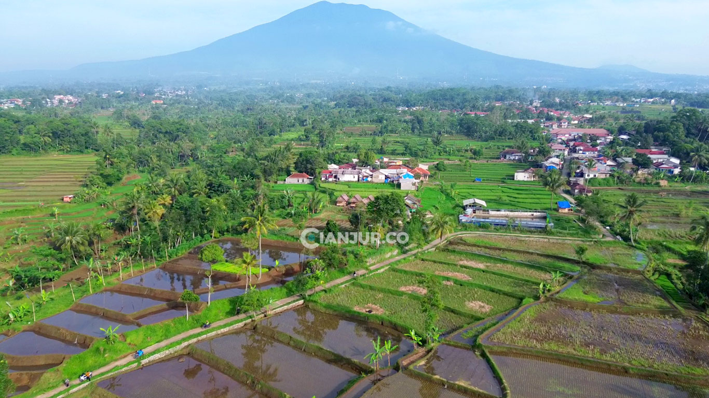

# Website Desa Sukakerta



Selamat datang di repositori proyek Website Desa Sukakerta. Proyek ini dibangun sebagai **portal informasi, pelayanan publik, dan transparansi** digital bagi masyarakat Desa Sukakerta, Kecamatan Panumbangan, Kabupaten Ciamis.

## 🎯 Tujuan & Visi

1.  **Akses Informasi**: Meningkatkan akses informasi desa secara cepat dan terbuka.
2.  **Layanan Digital**: Menyediakan layanan administrasi digital untuk warga.
3.  **Promosi Potensi**: Memperkenalkan potensi ekonomi dan wisata desa.
4.  **Transparansi**: Mendukung transparansi anggaran dan kegiatan pembangunan.
5.  **Arsip Digital**: Menjadi arsip digital desa yang dapat diakses kapan pun.

## ✨ Fitur Utama

Proyek ini (saat ini pada tahap frontend) telah mengimplementasikan beberapa fitur utama dari rencana pengembangan:

-   **Halaman Utama Dinamis**: Tampilan modern dengan *hero section*, navigasi cepat, dan sambutan kepala desa.
-   **Navigasi Sticky & Responsif**: Header yang berubah saat di-scroll dan menu *mobile-friendly* menggunakan Alpine.js.
-   **Peta Desa Interaktif**: Visualisasi lokasi dan batas wilayah desa menggunakan **Leaflet.js** dan data GeoJSON.
-   **Statistik Penduduk**: Grafik perbandingan gender (Doughnut) dan distribusi pekerjaan (Bar) yang dimuat dari file `penduduk.json` menggunakan **Chart.js**.
-   **Transparansi APBDes**:
    -   Kartu ringkasan pendapatan, belanja, dan pembiayaan.
    -   Grafik perbandingan anggaran vs. realisasi untuk pendapatan dan belanja.
    -   Semua data dimuat secara dinamis dari `apbdes2024.json`.
-   **Struktur Organisasi**: Tampilan daftar anggota BPD yang interaktif.
-   **Berita & Artikel**: Sistem paginasi sisi klien (client-side) untuk menampilkan daftar berita.
-   **Lapak Desa**: Katalog produk UMKM dengan fitur pencarian dan filter kategori dinamis.
-   **Galeri Foto**: Galeri dengan filter kategori dan *lightbox modal* untuk menampilkan gambar lebih besar.
-   **Footer Dinamis**: Konten footer (info kontak, tautan, copyright) dikelola melalui JavaScript untuk kemudahan pembaruan.

## 🛠️ Teknologi yang Digunakan

| Komponen | Teknologi | Keterangan |
| :--- | :--- | :--- |
| **Struktur & Gaya** | HTML5, **TailwindCSS** | Desain responsif dan modern dengan utility-first CSS. |
| **Interaktivitas** | **Alpine.js** | Untuk fungsionalitas UI seperti dropdown, modal, dan tab. |
| **Visualisasi Data** | **Chart.js** | Membuat grafik untuk statistik penduduk dan APBDes. |
| **Pemetaan** | **Leaflet.js** | Menampilkan peta interaktif dan batas wilayah (GeoJSON). |
| **Sumber Data** | File **JSON** | Data untuk grafik dan peta saat ini dimuat dari `assets/data/*.json`. |
| **Ikon** | Heroicons, FontAwesome | Digunakan di beberapa bagian untuk memperkaya UI. |

### Rencana Pengembangan (Backend)

Sesuai dengan dokumen perencanaan, sistem ini dirancang untuk dikembangkan lebih lanjut dengan:

-   **Backend**: Laravel / CodeIgniter 4
-   **Database**: MySQL / MariaDB
-   **Autentikasi**: Login berbasis NIK untuk warga dan *role-based* untuk admin.

## 📂 Struktur Folder

```
desa-sukakerta/
├── assets/
│   ├── data/
│   │   ├── apbdes2024.json   # Data Anggaran Desa
│   │   └── penduduk.json     # Data Statistik Penduduk
│   ├── img/                  # Gambar dan aset visual
│   ├── js/
│   │   ├── chart.js          # Logika untuk semua grafik (Chart.js)
│   │   ├── map.js            # Logika untuk peta (Leaflet.js)
│   │   └── main.js           # Skrip utama & data (misal: footer)
│   └── docs/                 # Dokumen publik seperti PDF APBDes
├── components/
│   └── footer.html           # Contoh komponen (saat ini tidak terpakai, diganti JS)
├── index.html                # Halaman Utama
├── profil.html               # Halaman Profil Desa (Contoh)
├── ... (halaman lainnya)
└── README.md                 # Anda sedang membacanya
```

## 🚀 Menjalankan Proyek Secara Lokal

Karena proyek ini masih berupa frontend statis, Anda tidak memerlukan server backend yang kompleks.

1.  **Clone Repositori**
    ```bash
    git clone https://github.com/username/desa-sukakerta.git
    cd desa-sukakerta
    ```

2.  **Buka `index.html`**
    Anda bisa langsung membuka file `index.html` di browser Anda.

3.  **Gunakan Live Server (Direkomendasikan)**
    Untuk menghindari masalah CORS saat memuat file JSON, disarankan menggunakan ekstensi **Live Server** di Visual Studio Code.
    -   Pasang ekstensi Live Server dari marketplace VS Code.
    -   Klik kanan pada file `index.html` di explorer VS Code.
    -   Pilih "Open with Live Server".

## 🤝 Kontribusi

Kontribusi untuk pengembangan proyek ini sangat diterima. Anda bisa memulai dengan:

-   Melakukan *fork* pada repositori ini.
-   Membuat *branch* baru untuk fitur atau perbaikan (`git checkout -b fitur/nama-fitur`).
-   Melakukan *commit* terhadap perubahan Anda (`git commit -m 'Menambahkan fitur X'`).
-   Melakukan *push* ke *branch* Anda (`git push origin fitur/nama-fitur`).
-   Membuat *Pull Request*.

---

Dibuat dengan ❤️ untuk kemajuan Desa Sukakerta.